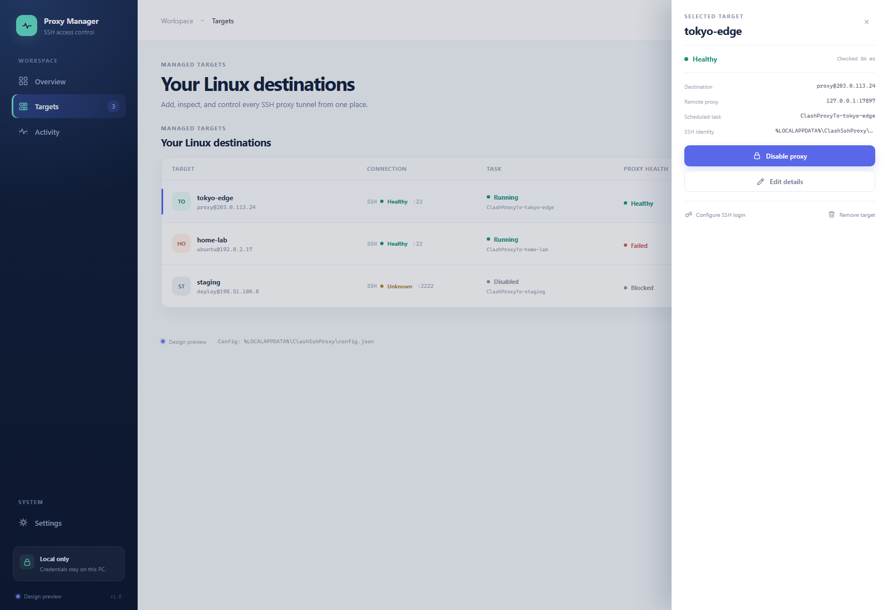
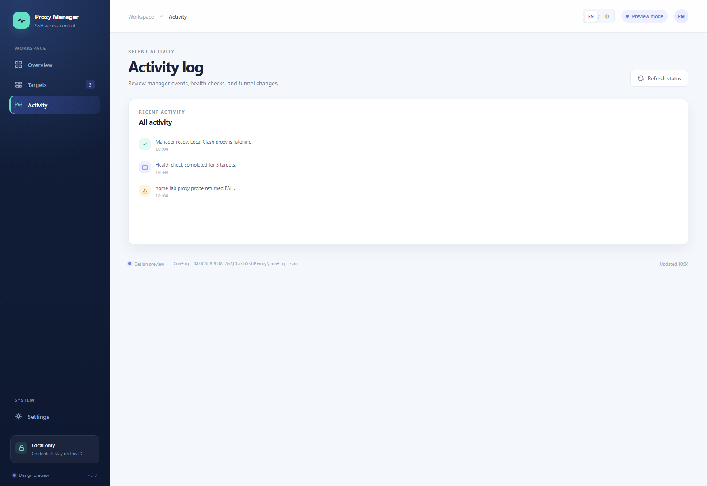

# Clash SSH Proxy Manager

  
<strong>A clean local UI for managing SSH proxy tunnels from Windows to remote Linux hosts through Clash.</strong>

  

    <a href="https://github.com/Scrates1/clash-ssh-proxy-bootstrap/archive/refs/heads/main.zip"><strong>Download ZIP</strong></a>
    ·
    <a href="docs/WINDOWS-UI.en-US.md">UI Guide</a>
    ·
    <a href="README.md">中文 README</a>
    ·
    <a href="https://github.com/Scrates1/clash-ssh-proxy-bootstrap/issues">Issues</a>
  

  

    
    
    
  

  

Overview, tunnel health, and the local Clash endpoint in one window. The screenshot uses documentation-only preview data.

> [!IMPORTANT]
> No web server deployment or Node.js installation is required. Download the complete ZIP, extract it,
> and double-click Open-ProxyManager.vbs. The UI handles remote script installation and tunnel onboarding
> only when you add a Linux target.

## What it solves

This is a local Windows manager for routing account traffic from remote Linux hosts through the local
Clash proxy over SSH reverse tunnels. Targets are isolated: enabling, disabling, updating, or removing
one target does not affect the others.

| Local control | Target isolation | Secure defaults |
| --- | --- | --- |
| One React dashboard for overview, targets, and activity | Each target has its own task, tunnel, and SSH key | Manager and proxy endpoints are loopback-only |
| UI-led SSH checks, installation, startup, and health verification | Target access can be enabled or disabled independently | Passwords are not stored and private keys stay local |

## Start in 3 minutes

### 1. Download and launch

1. Download the [current ZIP package](https://github.com/Scrates1/clash-ssh-proxy-bootstrap/archive/refs/heads/main.zip) and extract it.
2. Keep Open-ProxyManager.vbs, web/dist, and the other files in their original layout.
3. Double-click Open-ProxyManager.vbs.
4. Approve the Windows UAC prompt; the local React UI opens automatically.

Normal use does not require npm, Node.js, Docker, a database, or a separate web server. Open-ProxyManager.cmd
is available as a fallback launcher, but VBS is preferred when you want to avoid a console flash.

### 2. Check the prerequisites

- Windows 10 or Windows 11.
- Windows OpenSSH Client, including ssh.exe and scp.exe.
- Clash or an HTTP-compatible mixed proxy listening on 127.0.0.1:7897.
- A reachable SSH account on the Linux target; root is not required.
- OpenSSH server, Bash, curl, and standard GNU tools on Linux.

### 3. Add the first Linux target in the UI

1. Open **Targets** and click **Add target**.
2. Enter the target name, Linux host/IP, Linux user, SSH port, and remote proxy port.
3. Leave the private-key path under **Advanced SSH settings** empty so the manager creates a dedicated
   Ed25519 identity for this target.
4. Click **Continue to SSH check**.
5. If the remote account has not accepted the public key, click **Open SSH setup** and enter the Linux
   password once in the temporary PowerShell window.
6. Return to the wizard, click **Verify SSH**, and wait for **Install & verify** to finish.
7. After onboarding, enable or disable the target and inspect its health from the target list.

The wizard installs the Linux runtime scripts, creates the Windows scheduled task, starts the reverse
tunnel, and verifies the proxy. The password is used only for first-time public-key installation and
is never sent to the UI or written to disk.

## UI workflow

<table>
  <tr>
    <td width="50%" valign="top">
      
      
<strong>Targets</strong> Inspect SSH, scheduled-task, proxy-health, and access states.

    </td>
    <td width="50%" valign="top">
      
      
<strong>Add target</strong> Follow Connection details → SSH key → Install & verify.

    </td>
  </tr>
  <tr>
    <td width="50%" valign="top">
      
      
<strong>Target details</strong> Edit, enable, configure SSH login, restart, or remove one target.

    </td>
    <td width="50%" valign="top">
      
      
<strong>Activity</strong> Review health checks, tunnel changes, and manager events.

    </td>
  </tr>
</table>

## The four pages

| Page | What you can do |
| --- | --- |
| Overview | Check the local Clash endpoint, active tunnels, health, and attention items |
| Targets | Add, inspect, edit, enable, disable, check, or remove targets |
| Activity | Review health checks, recovery, enable/disable, and removal events |
| Settings | Switch between English and Chinese; the choice is stored locally |

Clicking a target row opens a separate target detail view; the page does not jump or scroll to another
section. Refresh keeps the current layout and loads real local manager state instead of inventing placeholder
devices.

## Keys and security

- Every target receives a stable target ID and a dedicated local Ed25519 private key.
- Exact duplicate detection uses server address + user; SSH port is a connection setting, not target identity.
- Windows keeps the private key; the Linux account receives the matching public key.
- Removing a target explicitly asks whether a manager-generated dedicated key should also be deleted;
  manually supplied external keys are kept.
- The manager bridge and Linux proxy endpoint listen only on 127.0.0.1.
- The Linux account is never deleted, and disabling one target does not affect other servers.

## FAQ

### Is deployment required?

No manager deployment is required. This is a local Windows application: download, extract, and launch it.
Remote installation during **Add target** only onboards a Linux host to the proxy tunnel; it is not web
server deployment.

### Why does a PowerShell window appear during the first target setup?

Only when the remote account has not accepted the SSH public key. Type or paste the Linux password and
press Enter, wait for the key installation to finish, and return to the UI to verify SSH. SSH password
input does not echo characters or asterisks. If Ctrl+V does not paste, use right-click or Shift+Insert.
The password is not saved.

### The local Clash endpoint is offline

Start Clash, confirm that its mixed proxy listens on 127.0.0.1:7897, and click **Refresh status** on
**Overview**. The current version uses this local endpoint by default.

### Where can I troubleshoot?

- [English Windows UI Guide](docs/WINDOWS-UI.en-US.md)
- [中文 Windows UI 使用指南](docs/WINDOWS-UI.zh-CN.md)
- [Security](SECURITY.md)
- [Architecture](docs/ARCHITECTURE.zh-CN.md)
- [Changelog](CHANGELOG.md)

## Project notes

The controller currently supports Windows; Linux hosts are managed targets. A Linux/macOS controller is
not included yet. The UI is built with React/Vite, while PowerShell provides the local bridge and tunnel
management. Normal users do not need to build the frontend.

[中文 README](README.md) · [License: MIT](LICENSE)
