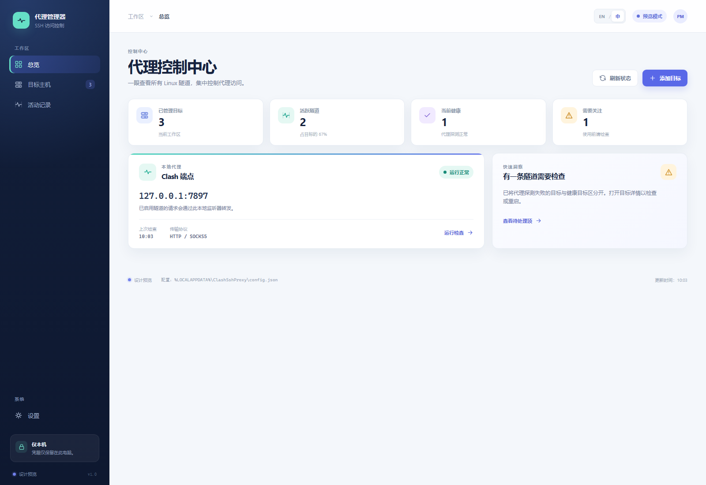
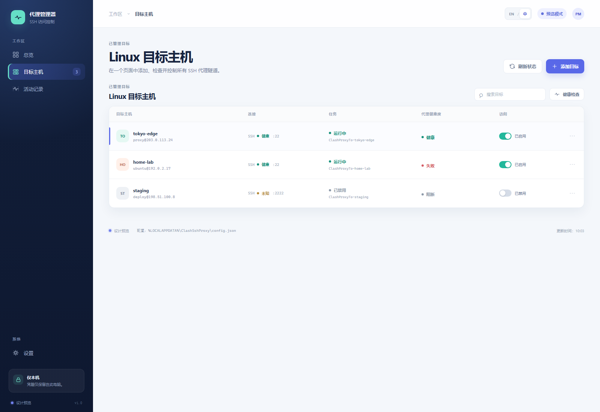
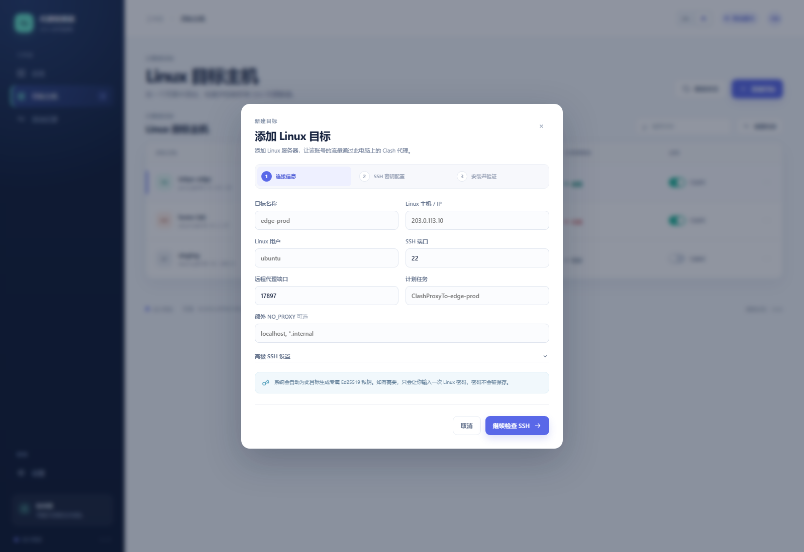

# Clash SSH Proxy Manager

  
<strong>在 Windows 上，用一个清晰的本地 UI 管理远程 Linux 主机的 Clash SSH 代理隧道。</strong>

  

    <a href="https://github.com/Scrates1/clash-ssh-proxy-bootstrap/archive/refs/heads/main.zip"><strong>下载 ZIP</strong></a>
    ·
    <a href="docs/WINDOWS-UI.zh-CN.md">UI 使用指南</a>
    ·
    <a href="README.en.md">English README</a>
    ·
    <a href="https://github.com/Scrates1/clash-ssh-proxy-bootstrap/issues">问题反馈</a>
  

  

    
    
    
  

  

总览、隧道健康度和本机 Clash 端点集中在一个窗口中。截图使用文档专用预览数据。

> [!IMPORTANT]
> 不需要部署 Web 服务，也不需要安装 Node.js。下载完整 ZIP、解压、双击 Open-ProxyManager.vbs
> 即可启动。只有在 UI 中添加 Linux 目标时，程序才会自动完成远端脚本安装和隧道接入。

## 它解决什么问题

这是一台 Windows 控制端上的本地管理器：把远程 Linux 主机的账号流量，通过 SSH 反向隧道
转发到本机 Clash。每台目标主机独立管理，启用、禁用、更新或移除一个目标不会影响其他目标。

| 本地控制 | 多目标隔离 | 安全默认值 |
| --- | --- | --- |
| React 仪表盘统一查看总览、目标和活动记录 | 每个目标有独立任务、隧道和 SSH 私钥 | 管理器与代理端点只监听回环地址 |
| UI 完成 SSH 检查、安装、启动和健康验证 | 目标状态可以单独启用或禁用 | 密码不保存，私钥不上传 |

## 3 分钟开始

### 1. 下载并启动

1. 下载 [当前 ZIP 包](https://github.com/Scrates1/clash-ssh-proxy-bootstrap/archive/refs/heads/main.zip) 并解压。
2. 保持 Open-ProxyManager.vbs、web/dist 和其他文件的目录结构不变。
3. 双击 Open-ProxyManager.vbs。
4. 出现 Windows UAC 提示时选择“是”，随后管理器会打开本机 React UI。

普通使用不需要 npm、Node.js、Docker、数据库或额外的 Web 服务器。Open-ProxyManager.cmd
可以作为备用入口，但优先使用 VBS 以避免黑色窗口闪烁。

### 2. 确认运行前置条件

- Windows 10 或 Windows 11。
- Windows OpenSSH Client，包含 ssh.exe 和 scp.exe。
- Clash 或兼容 HTTP 的混合代理正在监听 127.0.0.1:7897。
- 目标 Linux 主机可通过 SSH 访问，账号不需要 root。
- Linux 主机具备 OpenSSH server、Bash、curl 和标准 GNU 工具。

### 3. 用 UI 添加第一台 Linux 主机

1. 进入“目标主机”，点击“添加目标”。
2. 填写目标名称、Linux 主机/IP、Linux 用户、SSH 端口和远端代理端口。
3. “高级 SSH 设置”中的私钥路径留空，让管理器自动生成该目标专属的 Ed25519 私钥。
4. 点击“继续检查 SSH”。
5. 如果远端还没有公钥，点击“打开 SSH 配置”，在临时 PowerShell 窗口输入一次 Linux 密码。
6. 回到向导点击“验证 SSH”，然后等待“安装并验证”完成。
7. 成功后，在目标列表中启用或禁用该目标，随时查看健康状态。

向导会自动安装 Linux 端运行脚本、创建 Windows 计划任务、启动反向隧道并验证代理。
密码只在首次安装公钥时临时使用，不会传给 UI 或写入磁盘。

## UI 操作流程

<table>
  <tr>
    <td width="50%" valign="top">
      
      
<strong>目标主机</strong> 查看 SSH、计划任务、代理健康度和启用状态。

    </td>
    <td width="50%" valign="top">
      
      
<strong>新增目标</strong> 按“连接信息 → SSH 密钥 → 安装验证”完成接入。

    </td>
  </tr>
  <tr>
    <td width="50%" valign="top">
      
      
<strong>目标详情</strong> 编辑、启用、配置 SSH 登录、重启或移除单个目标。

    </td>
    <td width="50%" valign="top">
      
      
<strong>活动记录</strong> 查看健康检查、隧道变化和管理器操作日志。

    </td>
  </tr>
</table>

## 四个页面

| 页面 | 你可以做什么 |
| --- | --- |
| 总览 | 查看本机 Clash 是否在线、活跃隧道数量、健康状态和需要关注的目标 |
| 目标主机 | 添加、查看、编辑、启用、禁用、检查或移除目标 |
| 活动记录 | 查看健康检查、启动恢复、启用/禁用和移除事件 |
| 设置 | 切换中文和英文；语言选择保存在本机 |

点击目标行会打开独立的目标详情，不会把页面下拉到其他区域。刷新时 UI 保留当前布局，
加载真实本地状态，不会生成“设备 3”之类的伪数据。

## 密钥和安全

- 每个目标拥有稳定的目标 ID 和独立的本机 Ed25519 私钥。
- 精确重复判断使用“服务器地址 + 用户名”；SSH 端口是连接参数，不是目标唯一性。
- Windows 保存私钥，Linux 账号接收对应的公钥。
- 删除目标时，UI 会明确询问是否同时删除管理器生成的专属私钥；外部私钥会保留。
- 管理器桥接服务和 Linux 代理端点均只监听 127.0.0.1。
- Linux 账号本身不会被删除，禁用一个目标也不会影响其他服务器。

## 常见问题

### 需要部署吗？

不需要部署管理器。它是一个本地 Windows 应用：下载、解压、双击启动即可。
“添加目标”时发生的远端安装，是把某台 Linux 主机接入代理隧道，不是部署 Web 服务。

### 为什么首次添加目标会出现 PowerShell 窗口？

只有在远端尚未接受 SSH 公钥时才会出现。输入一次 Linux 密码，等待公钥安装完成，
再回到 UI 验证 SSH。密码不会保存。

### 本机 Clash 显示离线怎么办？

先启动 Clash，并确认混合端口监听 127.0.0.1:7897，然后在“总览”点击“刷新状态”。
当前版本默认使用这个本机端口。

### 如何深入排障？

- [Windows UI 使用指南](docs/WINDOWS-UI.zh-CN.md)
- [English Windows UI Guide](docs/WINDOWS-UI.en-US.md)
- [安全说明](SECURITY.md)
- [架构说明](docs/ARCHITECTURE.zh-CN.md)
- [更新记录](CHANGELOG.md)

## 项目信息

当前控制端支持 Windows；Linux 是被管理的目标主机，Linux/macOS 控制端暂未接入。
项目使用 React/Vite 构建界面，PowerShell 提供本地桥接和隧道管理。普通用户不需要构建前端。

[English README](README.en.md) · [License: MIT](LICENSE)
