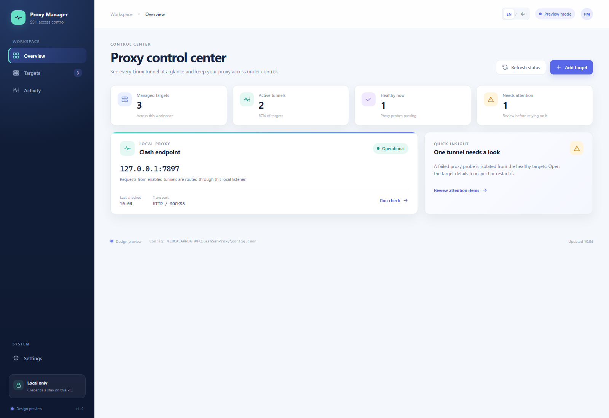
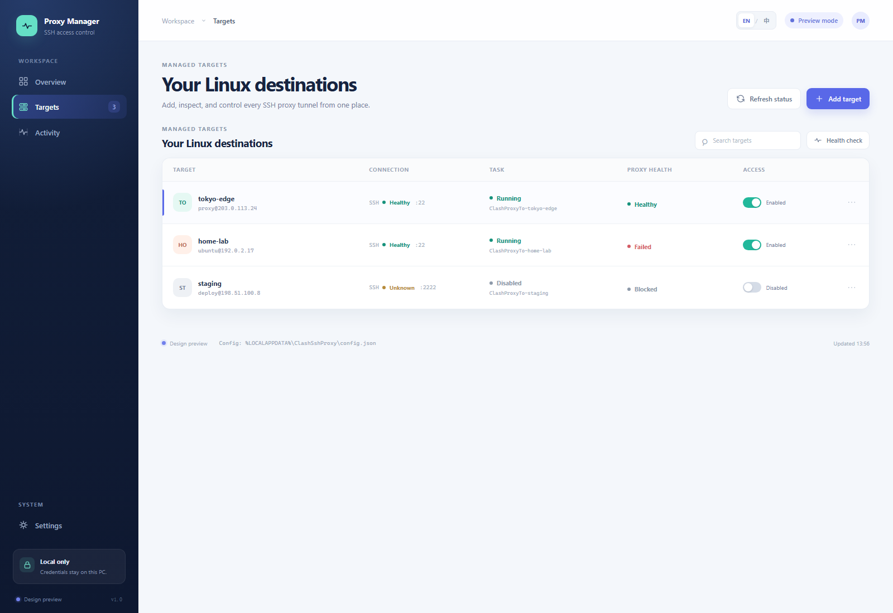
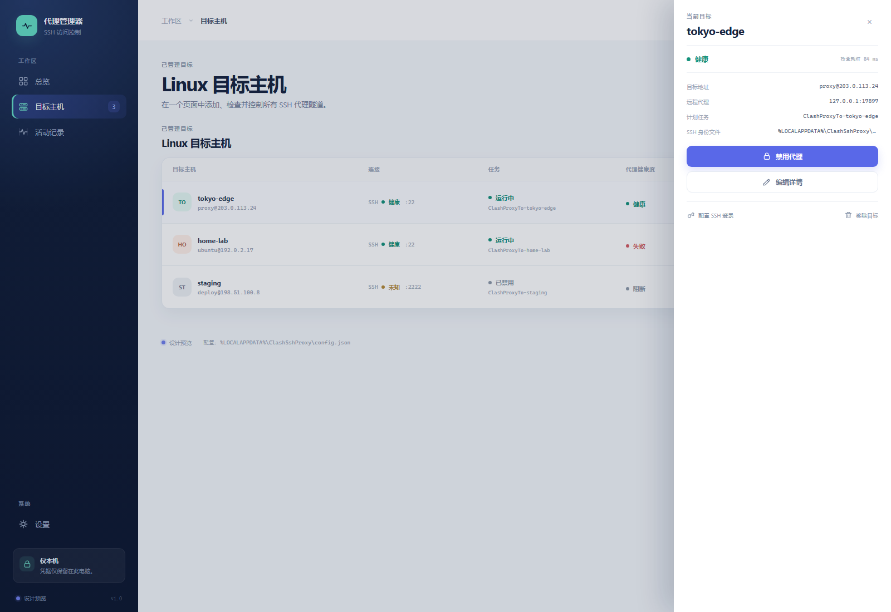
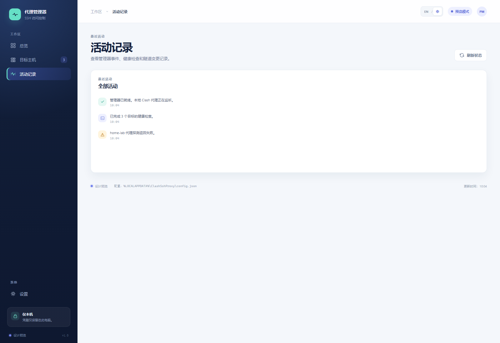
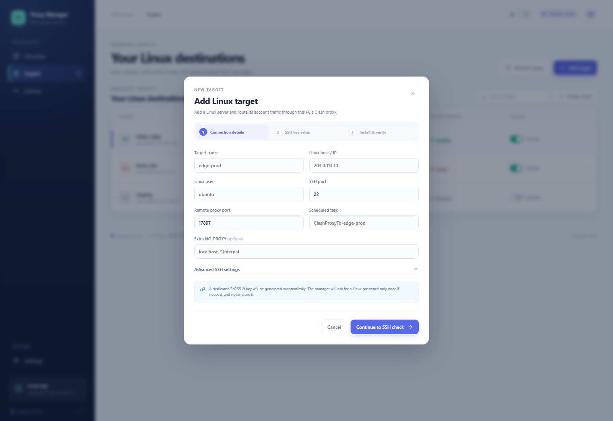

# clash-ssh-proxy-bootstrap

Use one Windows machine running Clash to provide an account-wide proxy for one
or more remote Linux hosts through loopback-only SSH reverse tunnels.

The project is designed for this topology:

```text
Linux host A ─┐
Linux host B ─┼─ SSH reverse tunnels ─> Windows 127.0.0.1:7897 ─> Clash ─> Internet
Linux host C ─┘
```

Each Linux host gets its own persistent SSH connection and Windows scheduled
task. Different Linux hosts may all use remote port `17897` because each port
lives on a different machine.

A Windows desktop manager and the PowerShell CLI use the same private
configuration and the same task-management commands.

## Security model

- The Linux proxy endpoint is fixed to `127.0.0.1`; it is never exposed on
  `0.0.0.0`.
- Passwords are never accepted as command-line parameters or written to disk.
- Scheduled tunnels require SSH public-key authentication.
- Scheduled tasks use `StrictHostKeyChecking=yes`.
- Adding a target or changing its task name refuses to overwrite an unrelated
  scheduled task. Task-name migrations stop and unregister the old task before
  the replacement can be enabled.
- The Windows `targets` list controls per-target access. Disabling a target stops
  and disables only that target's tunnel task.
- Loopback binding prevents other network machines from using a target's
  endpoint. Other local accounts on an enabled Linux host could still connect
  to the loopback port if they know it; shell integration is installed only for
  the selected account.
- Machine-specific host names, user names, ports, and key paths are stored by
  default in `%LOCALAPPDATA%\ClashSshProxy\config.json`, outside this Git repo.
- Windowless scheduled-task launchers are stored under
  `%ProgramData%\ClashSshProxy\tasks` with write access restricted to
  Administrators and SYSTEM.
- SSH private keys, application tokens, Codex `auth.json`, and remote shell
  backups must not be committed.

## Requirements

Windows controller:

- Windows 10 or 11
- PowerShell 5.1 or newer
- Windows OpenSSH Client (`ssh.exe`, `scp.exe`)
- Clash or another HTTP-compatible mixed proxy listening on loopback
- Administrator PowerShell for scheduled-task changes
- Node.js 20+ and npm are only needed when rebuilding the React UI from source

Linux target:

- Bash
- OpenSSH server
- `curl`, plus standard GNU userland tools
- A reachable SSH account; root is not required

## Windows desktop manager

For a completely console-free launch, double-click:

```text
Open-ProxyManager.vbs
```

The default launcher opens the React/Vite dashboard in a local Edge app window.
Its PowerShell bridge binds to `127.0.0.1` only and keeps the existing manager
commands, SSH behavior, and scheduled-task safeguards. The original WinForms
UI remains available by running `.\proxy-manager-ui.ps1` without `-React`.

If the checked-in UI bundle is missing or you are developing the frontend:

```powershell
Push-Location web
npm install
npm run build
Pop-Location
```

`Open-ProxyManager-React.cmd` is an explicit shortcut for the React launcher.

`Open-ProxyManager.cmd` remains as a compatibility entry point. It immediately
hands off to the VBS launcher, though Windows may briefly flash the CMD host.
Accept the Windows administrator prompt once. The desktop manager provides:

- target add, edit, update, and removal;
- one state-aware **Enable proxy / Restart proxy / Disable proxy** access control, also available
  by clicking the target's **Enabled** checkbox directly;
- scheduled-task state and local Clash availability;
- end-to-end SSH and remote proxy health checks;
- SSH identity creation and public-key login setup by default when adding a target;
- UTF-8 log rendering for Windows PowerShell and native SSH output.

**Disable proxy** closes access to this Windows Clash tunnel. It is not a Linux firewall and does not prevent the target from using a separate direct Internet route.

See the [Chinese Windows UI guide](docs/WINDOWS-UI.zh-CN.md) or click **Help** in the manager for button behavior, status meanings, and troubleshooting.
## UI preview

The desktop manager uses a React/Vite dashboard with separate **Overview**,
**Targets**, **Activity**, and **Settings** views. The interface supports English
and Chinese; use the `EN / 中` switch in the top bar to change language.

The screenshots below are captured from the built-in `?demo=1` preview mode.
They use documentation-only sample addresses and do not connect to a Linux
host or expose any real credentials.

<p align="center">
  
</p>
<p align="center"><sub>Overview / 总览 — local Clash endpoint, tunnel health, and quick insight.</sub></p>

<p align="center">
  
</p>
<p align="center"><sub>Targets / 目标主机 — inspect SSH status, scheduled tasks, proxy health, and access controls.</sub></p>

<p align="center">
  
</p>
<p align="center"><sub>Target details / 目标详情 — open a target without leaving the target list.</sub></p>

<p align="center">
  
</p>
<p align="center"><sub>Activity / 活动记录 — review health checks, tunnel changes, and manager events.</sub></p>

<p align="center">
  
</p>
<p align="center"><sub>Add target / 新增目标 — guided connection details, SSH key setup, and installation verification.</sub></p>

Quick refresh reads only local state. **Health check** contacts every Linux
target and can take several seconds per unreachable host. Starting with 0.2.8,
manual checks run concurrently in hidden target-scoped processes, leave the UI
interactive, and can be canceled by clicking **Cancel checks**. A newer action
for a target terminates its older check before starting another one.

**Enable proxy** and **Disable proxy** return after their local task/process
changes, then run a hidden check. The row shows `CHECKING` until Enable becomes
`OK` or `FAIL`, or Disable becomes `BLOCKED`, `LEAK`, or `UNKNOWN`. Enabled
target health uses one SSH session for both reachability and proxy verification.
Grid rows are updated in place, so the selected row and checkbox do not
disappear during refresh.

When a target is added, the manager creates the selected passwordless Ed25519
identity if it is missing and silently tests public-key login. A separate
PowerShell console appears only when Linux still needs the public key; the UI
does not receive or store the one-time password.

Scheduled tunnels run through a windowless WScript launcher. After the target is
updated to version 0.2.4 or newer, clicking **Enable proxy** does not create or
flash a separate SSH console window.

When the UI opens, it identifies enabled targets whose tasks are unexpectedly
`Ready` or `Disabled` and starts one hidden reconciliation process. That process
waits up to 30 seconds for the local proxy, recovers the targets sequentially,
and then hands them back to the UI for end-to-end verification. The primary
action changes to **Restart proxy** for those states. A missing task is not
started blindly; the UI shows **Update required** and directs the user to
**Edit / Update**.

## Quick start

Open an elevated PowerShell window in this repository.

Prepare the local key and check whether the Linux host already accepts it:

```powershell
.\proxy-manager.ps1 prepare-ssh `
  -Name development-server `
  -RemoteHost linux.example.com `
  -RemoteUser linuxuser
```

If the result says interaction is required, install the public key once:

```powershell
.\proxy-manager.ps1 bootstrap-key `
  -Name development-server `
  -RemoteHost linux.example.com `
  -RemoteUser linuxuser
```

`prepare-ssh` creates the selected passwordless Ed25519 key when missing.
`bootstrap-key` skips installation when login already works; otherwise SSH may
ask for the Linux password once. Only the public key is transferred and the
password is never stored.

Add and install the target:

```powershell
.\proxy-manager.ps1 add `
  -Name development-server `
  -RemoteHost linux.example.com `
  -RemoteUser linuxuser `
  -LocalProxyPort 7897 `
  -RemoteProxyPort 17897
```

The single Windows command uploads and installs the Linux-side files, creates
the scheduled tunnel task, starts it, and verifies the proxy.

Check every managed target:

```powershell
.\proxy-manager.ps1 status
```

## Existing installations

Use `adopt` when a Linux host and scheduled task already work and should be
recorded without reinstalling them:

```powershell
.\proxy-manager.ps1 adopt `
  -Name existing-server `
  -RemoteHost linux.example.com `
  -RemoteUser linuxuser `
  -TaskName ClashProxyToExistingServer
```

After adoption, run `update` once to migrate it to the repository-managed file
layout:

```powershell
.\proxy-manager.ps1 update -Name existing-server
```

## Multiple Linux hosts

Run `add` once per host. Each target receives an independent scheduled task:

```powershell
.\proxy-manager.ps1 add -Name server-a -RemoteHost server-a.example.com -RemoteUser alice
.\proxy-manager.ps1 add -Name server-b -RemoteHost server-b.example.com -RemoteUser bob
.\proxy-manager.ps1 status
```

Updating one host does not stop the others:

```powershell
.\proxy-manager.ps1 update -Name server-b
```

Update all recorded hosts:

```powershell
.\proxy-manager.ps1 update-all
```

Disable one Linux host without removing its configuration:

```powershell
.\proxy-manager.ps1 disable -Name server-b
```

`disable` returns after the local task and its exact managed SSH process have
closed. The desktop manager then verifies the remote port in the background;
the CLI `status` command performs the same check on demand. It reports
`BLOCKED` when closure is confirmed, `LEAK` if the port is still open, and
`UNKNOWN` when SSH is unavailable.

Enable it again and verify its proxy:

```powershell
.\proxy-manager.ps1 enable -Name server-b
```

`enable` and `disable` are the only public tunnel state controls. Internal
task-start and task-stop routines remain implementation details and are not
exposed as separate commands. Enable and Disable perform bounded local work,
then verify their selected target in the background. Use **Health check** when
you want fresh end-to-end status for every target; it checks targets in parallel
and does not block unrelated UI actions.

## Configuration

The manager's default private state file is:

```text
%LOCALAPPDATA%\ClashSshProxy\config.json
```

Use `-Config PATH` to select another file. `config.example.json` documents the
format. Configuration is written as BOM-less UTF-8 and read explicitly as
UTF-8 on both Windows PowerShell 5.1 and PowerShell 7. Unknown fields, control
characters, non-integral ports, and mismatched value types are rejected.
Target-level values override defaults.

New targets receive a stable `tgt-...` ID and a dedicated Ed25519 identity at
`%LOCALAPPDATA%\ClashSshProxy\keys\<target-id>.ed25519`. The matching `.pub`
file is used for the Linux account's `authorized_keys`. A target's ID and
identity path are never shared with another target. The legacy
`defaults.identityFile` value remains available so older configurations can be
read safely; new targets do not use that shared fallback.

```json
{
  "version": 1,
  "proxy": {
    "localHost": "127.0.0.1",
    "localPort": 7897
  },
  "defaults": {
    "sshPort": 22,
    "identityFile": "~/.ssh/id_ed25519",
    "remoteProxyPort": 17897,
    "noProxyExtra": []
  },
  "targets": []
}
```

The following values may be overridden for each target:

- `id` (optional for legacy files; generated for new targets)
- `enabled` (optional; defaults to `true` for older configurations)
- `sshPort`
- `identityFile`
- `identityManaged` (set automatically; external key files are never deleted by the manager)
- `remoteProxyPort`
- `noProxyExtra`
- `taskName`

The same `host + user` may only appear once. SSH port is a connection setting,
not a target identity. Every target must also use a different private-key path.
The remote bind address is deliberately not configurable.

The desktop manager permits one instance per Windows session. Mutating CLI and
UI operations also hold a path-scoped cross-process mutex across the complete
configuration read/modify/write transaction, so concurrent commands cannot
silently overwrite one another's target changes.

## Commands

| Command | Purpose |
|---|---|
| `prepare-ssh` | Create/repair the local identity and silently check key login |
| `bootstrap-key` | Interactively append the Windows public key to one Linux account |
| `add` | Install and start a new target, then save it in the manager config |
| `adopt` | Record an already-working target without changing it |
| `status` | Check scheduled tasks, SSH, and remote proxy health |
| `enable` | Enable and start one target persistently |
| `disable` | Disable and stop one target persistently |
| `update` | Reinstall one target idempotently and refresh its task |
| `update-all` | Update every recorded target |
| `remove` | Remove one task, Linux integration, and the matching remote public key; the UI can also remove its dedicated local key |
| `validate-config` | Validate JSON structure and parameter ranges |

Run `.\proxy-manager.ps1 help` for a compact command reference.

## Linux installation layout

The generated runtime configuration is intentionally separate from the source
checkout:

```text
~/.config/clash-ssh-proxy/
├── README.md
├── config.sh
├── proxy-on.sh
├── proxy-off.sh
├── shell-init.sh
├── check-linux.sh
├── uninstall-linux.sh
└── backups/
```

The installer adds one managed block near the beginning of the active Bash
startup files. Re-running it replaces the same block instead of appending
duplicates. If a startup file is a symbolic link, the link is preserved and its
resolved regular-file target is updated. Dangling links and malformed managed
blocks are rejected before shell files are changed.

On Linux:

```bash
proxy_status
proxy_off
proxy_on
```

The proxy is enabled for new Bash login sessions and programs launched from
them. `sudo`, systemd services, cron, Docker containers, and other users may not
inherit this environment and require separate configuration.

The Linux shell integration also exports `NODE_USE_ENV_PROXY=1` so Node.js
releases with built-in environment-proxy support use `HTTP_PROXY`,
`HTTPS_PROXY`, and `NO_PROXY` for native network requests. Running `proxy_off`
removes both the proxy variables and the Node.js opt-in.

## Failure behavior

The scheduled task starts 15 seconds after logon. Its windowless launcher
restarts a failed SSH tunnel after five seconds, with Task Scheduler retaining a
one-minute fallback restart policy. A Linux host loses proxy access when Windows
is off or logged out, Clash is stopped, the network is unavailable, or its SSH
task cannot connect. Other configured Linux hosts continue independently.

A disabled target remains disabled across Windows logons. Its Linux proxy files
remain installed so enabling it again does not require reinstalling the host.

Add and update operations fail closed. Administrator and task-name collision
checks run before Linux is modified. If task startup, proxy verification, or
configuration saving fails, the replacement tunnel is stopped and unregistered
with its launcher; a first-time Linux installation is rolled back to an
archived, recoverable directory. A failed task-name migration never leaves the
old logon task active. Run Update again to recreate a task removed by a failed
replacement.

`add` also refuses to overwrite an already installed Linux account integration
that is not yet represented by the new target. Adopt its existing Windows task,
or run the Linux uninstaller before treating it as a new installation.

Use `proxy_off` in an affected Linux shell when temporary direct access is
preferred.

## Code organization

The root CLI and UI scripts are stable, intentionally small entry points.
Implementation lives under `src`, grouped by configuration, SSH transport,
Windows tunnel lifecycle, Linux operations, UI runtime, health checks, and
dialogs. UI smoke-test logic lives under `tests` instead of the production
entry point.

See the [Chinese architecture guide](docs/ARCHITECTURE.zh-CN.md) for the module
dependency rules and where future SSH bootstrap work belongs.

## Development and tests

Linux tests:

```bash
bash tests/test-linux.sh
```

PowerShell parser and configuration tests:

```powershell
.\tests\Test-Manager.ps1
```

Run that suite in both Windows PowerShell 5.1 and PowerShell 7. It includes
parser, UTF-8 round-trip, strict configuration, task migration/rollback, exact
process identity, legacy-config migration, JSON status, and headless Windows UI
smoke tests.

The Linux installer test uses temporary HOME directories, runs installation
twice to verify idempotency, and verifies that install/uninstall preserve
startup-file symbolic links and unrelated shell settings while malformed
managed blocks fail closed. `tests/test-privacy.sh` rejects tracked private
keys, credential-like values, private IPv4 addresses, and sensitive state-file
names. GitHub Actions runs all Windows, Linux, and privacy checks for pushes and
pull requests.
